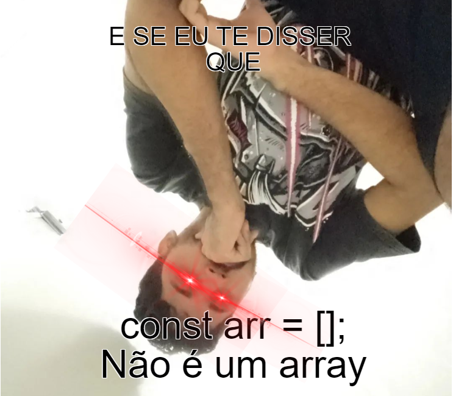

# Bem vindos meus casas

---

* Primeiro contato com algoritmos e estruturas de dados (espero que não seja o ultimo).

---

* Primeiro contato com algoritmos e estruturas de dados (espero que não seja o ultimo).
* Fortalecer as bases é o foco.

---

* Primeiro contato com algoritmos e estruturas de dados (espero que não seja o ultimo).
* Fortalecer as bases é o foco.

---

* Primeiro contato com algoritmos e estruturas de dados (espero que não seja o ultimo).
* Fortalecer as bases é o foco.
* Overview dos algoritmos e estruturas de dados mais fundamentais (as que eu estudei/acho que vão ser realmente úteis :P).

---

### Vale a pena estudar algoritmos atualmente?

> Eu deveria me importar com isso? 

* Ainda cobram isso em entrevistas hoje em dia?
* É um diferencial muito grande?
* Eu uso eles em algum lugar na vida real?

---

# Now we are going to learn...?

---


---

## Por que TypeScript você me pergunta...
 eu te respondo
 
---

## Vamos falar de complexidade de algoritmos?

### ***SIM***

* Entretando sem a parte matemática chata que não temos nem a base nem o tempo para estudar.
* Sem provas nem demonstrações.
* Conceitos e talvez alguns graficos.


---
## Agora vamos para uma pergunta introdutória

> Qual estrutura de dado é usada aqui? (não pensa muito só responde)

```typescript
const arr = [];
```

---


---

### Arrays são uma estrutura de dado muito simples e básica
#### Vamos entender melhor isso em breve

---

#### REFERÊNCIA DE LIVROS

#### Mais leve
* For Programmers Who Don't Know How To DataStructure And Would Like To Do Other Things Well Too

#### Mais densos
* The Introduction to Algorithms (3rd edition) (Cormem)
* Introduction to the Design and Analysis of Algorithms (3rd Edition) (Anany Levitin)
- Data Structures & Algorithm Analysis (3rd edition) (Clifford A. Shaffer)

---
